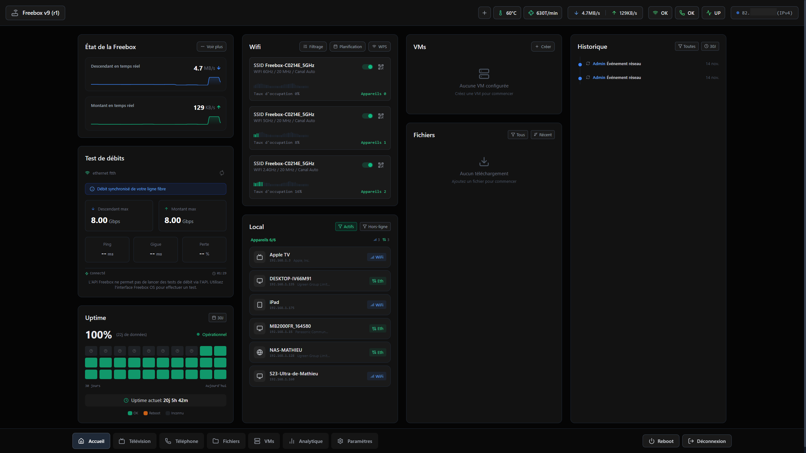
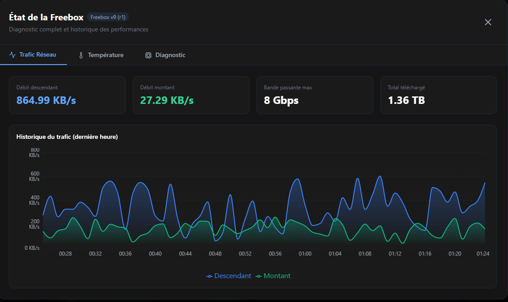
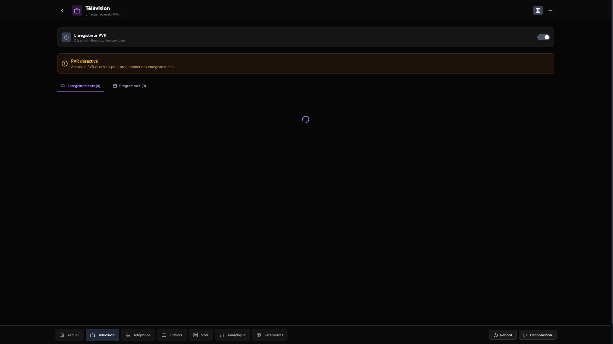
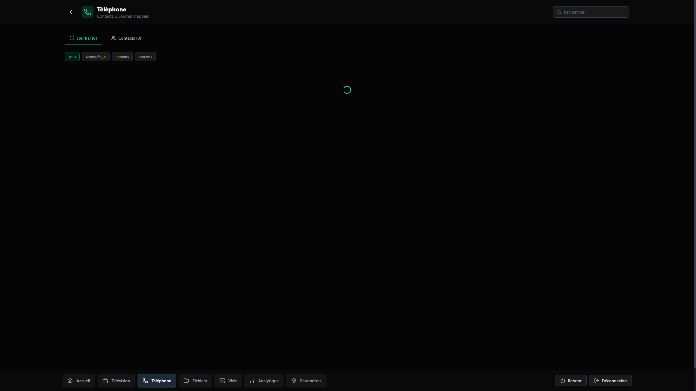
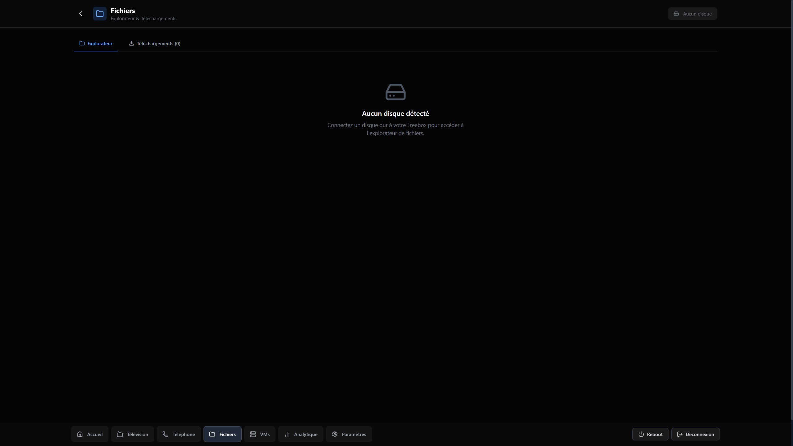
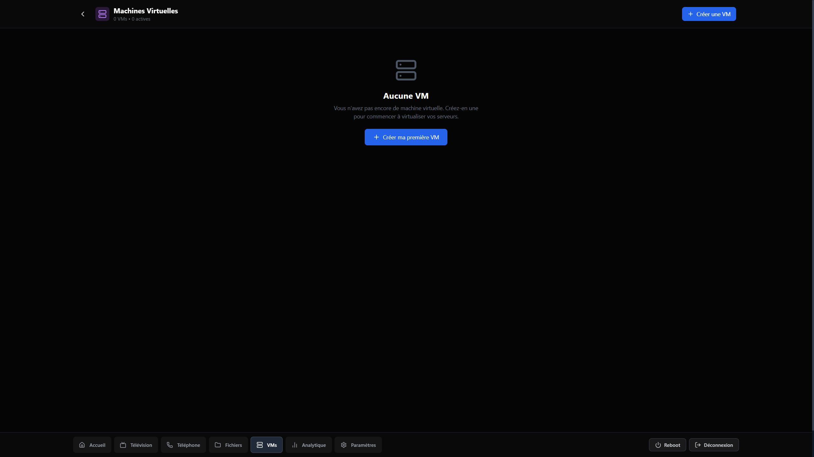
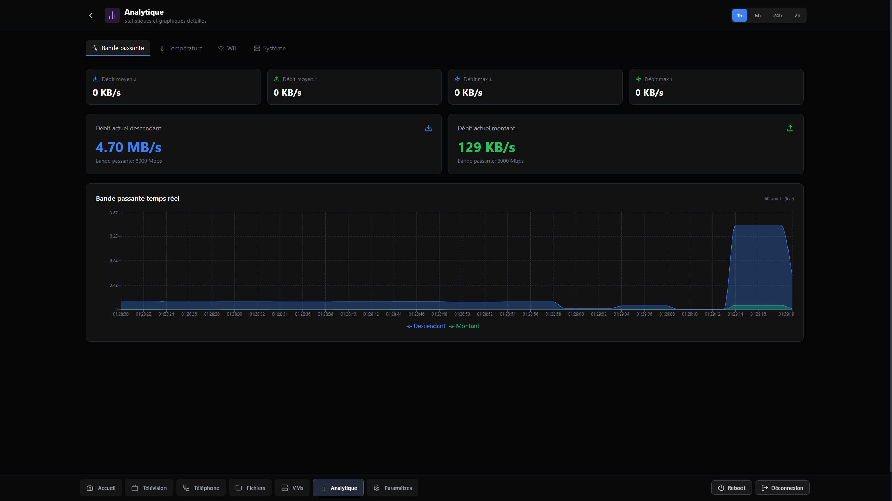
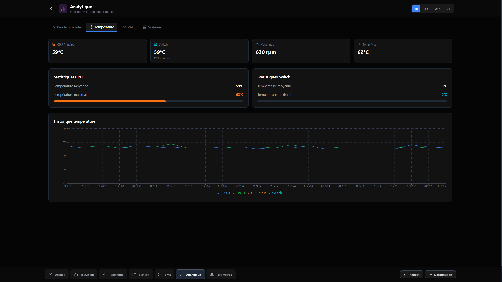
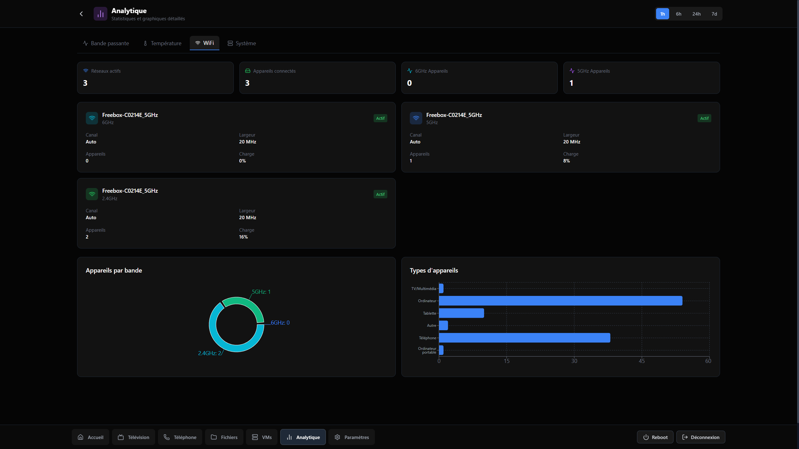

# Freebox OS Ultra Dashboard

<div align="center">


**Un dashboard moderne et complet pour la Freebox Ultra, Delta & Pop**

[Installation Docker](#installation-docker-recommandee) | [Fonctionnalites](#fonctionnalites) | [Configuration](#configuration) | [Developpement](#developpement)

</div>

---



> **Version BETA** - Ce projet est en cours de developpement. Des bugs peuvent etre presents et certaines fonctionnalites peuvent ne pas fonctionner comme prevu. N'hesitez pas a [signaler les problemes](../../issues) rencontres.

## Compatibilite

| Modele | Support | VMs | WiFi 6E |
|--------|---------|-----|---------|
| **Freebox Ultra** | Complet | Oui | Oui |
| **Freebox Delta** | Complet | Oui | Non |
| **Freebox Pop** | Complet | Non | Non |

## Apercu

Freebox OS Ultra Dashboard est une interface web alternative pour gerer votre Freebox. Construit avec React 19 et Express 5, il offre une experience utilisateur fluide et moderne avec des donnees en temps reel.

### Captures d'ecran

<details>
<summary>Voir les captures d'ecran</summary>












</details>

## Installation Docker (Recommandee)

Docker est la methode recommandee pour deployer sur NAS (Synology, QNAP), Raspberry Pi ou serveurs.

### Prerequis
- Docker et Docker Compose installes
- Acces au meme reseau local que la Freebox

### Lancement rapide

```bash
# Cloner le depot
git clone https://github.com/HGHugo/FreeboxOS-Ultra-Dashboard.git
cd FreeboxOS-Ultra-Dashboard

# Lancer le conteneur
docker-compose up -d
```

Le dashboard sera accessible sur :
- **http://localhost:7505** - depuis la machine hote
- **http://IP_DU_SERVEUR:7505** - depuis un autre appareil du reseau (remplacez `IP_DU_SERVEUR` par l'adresse IP de la machine ou Docker est installe, ex: `192.168.1.100`)

### Configuration Docker

Personnalisez le deploiement avec des variables d'environnement :

```bash
# Changer le port (defaut: 7505)
DASHBOARD_PORT=8080 docker-compose up -d

# Ou avec un fichier .env
echo "DASHBOARD_PORT=8080" > .env
docker-compose up -d
```

| Variable | Defaut | Description |
|----------|--------|-------------|
| `DASHBOARD_PORT` | `7505` | Port d'acces au dashboard |
| `FREEBOX_HOST` | `mafreebox.freebox.fr` | Hostname de la Freebox |

### Persistance du token

Le token d'authentification est automatiquement sauvegarde dans un volume Docker (`freebox_dashboard_data`). Il persiste entre les redemarrages et mises a jour du conteneur.

### Commandes Docker utiles

```bash
# Voir les logs en temps reel
docker-compose logs -f

# Redemarrer le conteneur
docker-compose restart

# Arreter le conteneur
docker-compose down

# Mettre a jour vers la derniere version
git pull
docker-compose build --no-cache
docker-compose up -d
```

### Securite Docker

L'image Docker est configuree avec les bonnes pratiques de securite :
- Utilisateur non-root (`freebox`)
- Health check automatique
- Variables d'environnement configurables (pas de secrets hardcodes)

Merci à [Loule95450](https://github.com/Loule95450) & [Rayandri](https://github.com/Rayandri) pour la pull-request.

## Premiere connexion

Au premier lancement, vous devrez autoriser l'application sur la Freebox :

1. Accedez au dashboard (http://localhost:7505 ou votre IP)
2. Cliquez sur **"Connecter"** dans l'interface
3. **Sur votre Freebox** : Un message s'affichera sur l'ecran LCD
4. Appuyez sur la **fleche droite** (>) de la Freebox pour autoriser
5. L'application est maintenant connectee !

> **Note:** Pour certaines fonctionnalites (WPS, VPN, etc.), vous devrez peut-etre activer des permissions supplementaires dans Freebox OS > Parametres > Gestion des acces > Applications.

## Fonctionnalites

### Dashboard Principal
- **Debit en temps reel** - Surveillance du debit descendant/montant avec graphiques sparkline
- **Statut de connexion** - Etat de la ligne fibre, type de connexion, latence
- **Informations systeme** - Temperature CPU, utilisation memoire, uptime
- **Appareils connectes** - Liste des appareils sur le reseau local

### WiFi
- **Gestion des reseaux** - Configuration des bandes 2.4GHz, 5GHz et 6GHz (Ultra uniquement)
- **WPS** - Activation/desactivation du WPS avec bouton push
- **Filtrage MAC** - Gestion de la liste blanche/noire
- **QR Code** - Generation de QR codes pour connexion rapide

### VPN
- **Multi-protocoles** - Support OpenVPN (routed/bridge), PPTP, WireGuard
- **Gestion des serveurs** - Demarrage/arret des serveurs VPN
- **Statistiques** - Nombre de connexions actives

### Telechargements
- **Gestionnaire complet** - Ajout de torrents, URLs directes
- **Progression en temps reel** - Vitesse, ETA, statut
- **Controle** - Pause, reprise, suppression

### Fichiers
- **Explorateur** - Navigation dans les fichiers de la Freebox
- **Operations** - Copie, deplacement, renommage, suppression
- **Partage** - Creation de liens de partage

### Telephonie
- **Journal d'appels** - Historique complet avec filtres
- **Contacts** - Gestion du repertoire
- **Repondeur** - Ecoute des messages vocaux

### TV
- **Guide des programmes** - EPG en temps reel
- **Chaines** - Liste des chaines disponibles
- **Enregistrements** - Gestion des enregistrements programmes

### Machines Virtuelles (Ultra/Delta uniquement)
- **Gestion des VMs** - Demarrage, arret, redemarrage
- **Statistiques** - Utilisation CPU, memoire, disque
- **Creation** - Assistant de creation de VMs

### Controle Parental
- **Profils** - Creation de profils par utilisateur
- **Filtres** - Blocage de sites et categories
- **Horaires** - Plages horaires d'acces

### Analytiques
- **Historique bande passante** - Graphiques sur 1h, 24h, 7j
- **Temperatures** - Evolution des temperatures du systeme
- **Statistiques reseau** - Donnees detaillees de connexion

## Installation alternative (Node.js)

### Option 1 : Lancement direct

```bash
# Cloner le depot
git clone https://github.com/HGHugo/FreeboxOS-Ultra-Dashboard.git
cd FreeboxOS-Ultra-Dashboard

# Installer les dependances
npm install

# Build du frontend
npm run build

# Lancer le serveur
npm start
```

Le serveur sera accessible sur `http://localhost:3001`

### Option 2 : PM2 (Production)

PM2 permet de garder l'application en ligne 24/7 avec redemarrage automatique.

```bash
# Installer PM2
npm install -g pm2

# Build et lancer
npm run build
pm2 start npm --name "freebox-dashboard" -- start

# Demarrage automatique au boot
pm2 startup
pm2 save
```

## Developpement

### Mode Developpement

```bash
npm install
npm run dev
```

- Frontend : http://localhost:5173 (hot-reload)
- Backend API : http://localhost:3001

### Build Production

```bash
npm run build
```

## Architecture du projet

```
freebox-os-ultra-dashboard/
├── src/                          # Frontend React
│   ├── api/                      # Client API
│   ├── components/
│   │   ├── layout/               # Header, Footer, Sidebar
│   │   ├── modals/               # Modals (WiFi, VPN, VM, etc.)
│   │   ├── ui/                   # Composants reutilisables (Toggle, Card, etc.)
│   │   └── widgets/              # Widgets du dashboard
│   ├── hooks/                    # Hooks React personnalises
│   ├── pages/                    # Pages (Dashboard, TV, Phone, etc.)
│   ├── stores/                   # State management (Zustand)
│   ├── types/                    # Types TypeScript
│   └── utils/                    # Utilitaires (formatters, helpers)
│
├── server/                       # Backend Express
│   ├── middleware/               # Middlewares (error handler)
│   ├── routes/                   # Routes API
│   │   ├── auth.ts               # Authentification Freebox
│   │   ├── connection.ts         # Statut connexion
│   │   ├── wifi.ts               # Configuration WiFi
│   │   ├── lan.ts                # Appareils reseau
│   │   ├── downloads.ts          # Gestionnaire telechargements
│   │   ├── fs.ts                 # Systeme de fichiers
│   │   ├── vm.ts                 # Machines virtuelles
│   │   ├── calls.ts              # Journal d'appels
│   │   ├── tv.ts                 # TV et enregistrements
│   │   └── ...
│   ├── services/
│   │   ├── freeboxApi.ts         # Client API Freebox
│   │   └── modelDetection.ts     # Detection modele Freebox
│   └── types/                    # Types backend
│
├── dist/                         # Build frontend (production)
├── Dockerfile                    # Build Docker multi-stage
├── docker-compose.yml            # Configuration Docker Compose
└── package.json
```

## Technologies

| Categorie | Technologies |
|-----------|-------------|
| **Frontend** | React 19, TypeScript 5.8, Vite 6, Recharts, Lucide Icons |
| **State** | Zustand |
| **Backend** | Express 5, Node.js 20, TypeScript |
| **API** | Freebox OS API v2/v4 |
| **Style** | Tailwind CSS |
| **Deploiement** | Docker, PM2 |

## API Freebox

Ce projet utilise l'API officielle Freebox OS. Documentation : [dev.freebox.fr](https://dev.freebox.fr/sdk/os/)

### Endpoints implementes

| Endpoint | Description |
|----------|-------------|
| `/api/auth` | Authentification et gestion du token |
| `/api/connection` | Statut de connexion internet |
| `/api/system` | Informations systeme, reboot |
| `/api/wifi` | Configuration WiFi (bandes, WPS, etc.) |
| `/api/lan` | Appareils reseau, Wake-on-LAN |
| `/api/downloads` | Gestionnaire de telechargements |
| `/api/fs` | Systeme de fichiers |
| `/api/vm` | Machines virtuelles |
| `/api/calls` | Journal d'appels |
| `/api/contacts` | Repertoire telephonique |
| `/api/tv` | Guide TV et enregistrements |
| `/api/parental` | Controle parental |
| `/api/settings` | Parametres systeme |

## FAQ

<details>
<summary><strong>L'application ne se connecte pas a la Freebox</strong></summary>

1. Verifiez que vous etes sur le meme reseau local que la Freebox
2. Si vous utilisez Docker, assurez-vous que le conteneur peut atteindre `mafreebox.freebox.fr`
3. Verifiez que l'API Freebox est activee (Freebox OS > Parametres > Mode avance > API)
</details>

<details>
<summary><strong>Erreur "Droits insuffisants"</strong></summary>

Certaines fonctionnalites necessitent des permissions supplementaires :
1. Allez dans Freebox OS > Parametres > Gestion des acces > Applications
2. Trouvez "Freebox Dashboard"
3. Activez les permissions necessaires (Modification des reglages, etc.)
</details>

<details>
<summary><strong>Le token a expire apres redemarrage Docker</strong></summary>

Verifiez que le volume Docker est bien configure :
```bash
docker volume ls | grep freebox
```
Le volume `freebox_dashboard_data` doit exister et persister.
</details>

<details>
<summary><strong>L'onglet VMs n'apparait pas</strong></summary>

L'onglet VMs n'est visible que sur les modeles Freebox Ultra et Delta. La Freebox Pop ne supporte pas les machines virtuelles.
</details>

## Contribution

Les contributions sont les bienvenues !

### Guidelines

- Respectez le style de code existant
- Ajoutez des types TypeScript pour tout nouveau code
- Testez vos modifications avant de soumettre
- Documentez les nouvelles fonctionnalites

## Licence

Ce projet est sous licence MIT. Voir le fichier [LICENSE](LICENSE) pour plus de details.

### Design

Le design de ce dashboard a ete realise par **[@powl_d](https://x.com/powl_d)**. Merci pour ce magnifique travail !

### Remerciements

- [Free](https://www.free.fr) pour la Freebox et son API ouverte
- [Freebox SDK](https://dev.freebox.fr) pour la documentation
- La communaute open source pour les excellentes bibliotheques utilisees

---

<div align="center">

**Fait avec amour pour les utilisateurs de Freebox Ultra, Delta & Pop**

</div>
